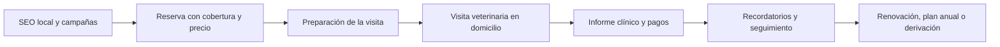

# Informe estratégico para una startup veterinaria a domicilio

## Resumen ejecutivo

El briefing describe una startup tecnológica de servicios veterinarios a domicilio pensada para el sur de Madrid y el norte de Toledo, con la ambición de combinar marca, producto digital, operación clínica y un modelo de negocio escalable; además pide benchmark de referencias como Pawwy, Mi Veterinario, AgendaPro y operadores locales, pero no fija un presupuesto ni un calendario cerrados de implantación. fileciteturn0file0L1-L19

La oportunidad existe, pero no en un hueco “vacío”, sino en un mercado ya activo y fragmentado. En España, el colectivo veterinario colegiado alcanzó 37.836 profesionales en 2024, y la clínica de pequeños animales superó las 7.100 clínicas según AMVAC; la misma asociación situó la facturación sectorial de clínica veterinaria por encima de 2.600 millones de euros en 2023, mientras que datos sectoriales difundidos en Iberzoo Propet 2026 elevaron la cifra de 2024 a 2.984 millones con crecimiento interanual del 9,2%. En paralelo, la convivencia con mascotas es masiva: el barómetro pet parent presentado en IFEMA señalaba que el 49% de los hogares españoles convivía con animales de compañía en 2024, y ANFAAC habla de más de 20 millones de mascotas en España. citeturn44view0turn8view0turn38search11turn38search2turn38news40

La conclusión principal es que **no conviene lanzar una marca genérica de “veterinario a domicilio” ni una simple app de citas**. Lo que mejor encaja con la evidencia competitiva y regulatoria es una propuesta más precisa: **atención veterinaria programada en domicilio para perros y gatos, con continuidad clínica digital, transparencia tarifaria, seguimiento postvisita y derivación clara a clínica u hospital cuando el caso requiera presencialidad intensiva o urgencias**. Vet2Go, Pide1Vet, Vetmovil Cocoa y otros competidores ya educan al mercado en “menos estrés, menos desplazamientos, más comodidad”, pero dejan margen para diferenciarse mejor en continuidad, experiencia, confianza, documentación y sensibilidad en servicios de fin de vida. citeturn25view4turn30view0turn30view2turn26view0turn26view2turn25view6

El posicionamiento más sólido no es “la app”, sino **el servicio clínico apoyado por software**. Aquí las referencias útiles se dividen en cuatro familias. Pawwy y Mi Veterinario enseñan qué funcionalidades fidelizan a tutores y clínicas: recordatorios, fichas, agenda, comunicación, carnés y documentos. PetDesk, Vello y Vet2Pet muestran qué herramientas reducen llamadas, no-shows y fricción operativa. FirstVet y Vetster enseñan el patrón de triage remoto y derivación, pero no sustituyen el acto clínico presencial. Roo, por su parte, es un buen espejo para pensar capacidad profesional y cobertura futura, aunque no debería ser el modelo inicial de cara al cliente final. citeturn31view0turn32view0turn32view1turn32view2turn32view4turn34view2turn34view3turn34view4turn33view0turn34view0turn25view7

También hay una conclusión fuerte sobre marca. Los nombres **Calmavet, PawVet, VetCalm y VetHome** presentan señales de conflicto o banalidad demasiado altas: *Calmavet* ya es una marca/servicio activo; *Pawvet* identifica una clínica activa; *VetCalm* aparece usado en productos de bienestar animal; *VetHome* es extremadamente genérico y además lo usan servicios de telehealth ajenos al sector pet. La recomendación es trabajar con un nombre más distintivo, registrable y defendible, y hacer el cribado obligatorio en OEPM y, si hay ambición europea, también en EUIPO/TMview antes de decidir. citeturn37view0turn37view1turn19search1turn37view2turn39view6turn39view5

En lo legal, el proyecto necesita entrar bien desde el inicio. En Madrid, la propia Comunidad recuerda que los veterinarios deben estar colegiados en la comunidad autónoma donde ejercen. La Ley 7/2023 permite la eutanasia solo bajo criterio y control veterinario, para evitar sufrimiento por causas no recuperables, y exige que la realice personal veterinario colegiado con métodos humanitarios. El Real Decreto 666/2023 regula prescripción y uso de medicamentos veterinarios y conecta con PRESVET; además, PRESCRIVET 2.0 exige certificado electrónico y trazabilidad para receta electrónica. Y la venta online de medicamentos veterinarios no sujetos a prescripción está reservada a farmacias o establecimientos autorizados, sin intermediarios y excluyendo los medicamentos sujetos a receta. Todo ello empuja a un MVP prudente: **sin marketplace de medicamentos, sin promesas ambiguas de telemedicina clínica total y con fuerte control documental, de consentimientos y de trazabilidad**. citeturn39view4turn40view0turn39view1turn39view7turn41view0

## Mercado y competencia

La demanda estructural es favorable. En 2024, el INE registró 37.836 veterinarios colegiados en España, mientras AMVAC describía ya un ecosistema de más de 7.100 clínicas de pequeños animales y una facturación superior a 2.600 millones de euros en 2023, con empleo directo por encima de 44.000 personas. Además, el informe sectorial de AMVAC reflejaba que la consolidación corporativa en España seguía siendo moderada frente a Reino Unido, Países Bajos o Francia, lo que sugiere un mercado todavía muy fragmentado y con espacio para operadores bien definidos en nichos geográficos y de experiencia. citeturn44view0turn8view0

La base de adopción de mascota es suficientemente amplia para sostener una propuesta especializada. IFEMA-Iberzoo recogió que el 49% de los hogares españoles convivía con mascotas en 2024 dentro del barómetro *pet parent*, y ANFAAC publica que en España hay más de 20 millones de mascotas. Las cifras exactas varían según metodología y especies incluidas, así que para dimensionar negocio es más prudente trabajar con dos métricas estables: **hogares con mascota** y **volumen operativo de perros y gatos**, no con un único dato absoluto de “mascotas totales”. citeturn38search11turn38search2

En Madrid, la competencia domiciliaria no es anecdótica. El directorio de COLVEMA lista numerosos servicios “a domicilio” en la Comunidad, incluyendo Aloha Vet, Pide1Vet, Vet2Go, Vetmovil Cocoa, EasyVet, Tu Vet en Casa y otros operadores individuales o microempresas. Eso indica que la barrera de entrada comercial no es inexistente y que el usuario madrileño ya reconoce esta categoría de servicio. Lo importante no será “ser el primero”, sino **ser más claro, más confiable y más fácil de usar** en una zona concreta. citeturn35view0

Para ordenar el benchmark, conviene distinguir cinco tipos de referencia:

| Referencia | Tipo | Señal relevante | Qué enseña |
|---|---|---|---|
| Pawwy | Software veterinario B2B/B2B2C | Ficha clínica, app para tutores, QR, recetas, agenda, métricas y plan para domicilios | El valor del ecosistema clínico + app + identidad digital de la mascota citeturn31view0 |
| Mi Veterinario | App de clínica y fidelización | Citas, recordatorios, promociones, comunicación con centro, integración con WinVet | El canal móvil sirve para retención y frecuencia, no como propuesta central por sí solo citeturn32view0turn32view1turn32view2 |
| Vet2Go | Operador de veterinario a domicilio | Reserva con precio antes de confirmar, seguimiento en app, 80% de procedimientos en casa, cobertura amplia, plantilla propia | Buen patrón de operación controlada y experiencia híbrida web+app citeturn25view4turn30view0turn30view1 |
| Pide1Vet | Operador local con tarifa transparente | Misma veterinaria, sin desplazamiento, packs anuales, consumo mínimo visible | Confianza y sencillez tarifaria venden mucho en servicio recurrente citeturn26view0turn26view1turn25view5 |
| FirstVet y Vetster | Teleorientación / telehealth | Cuestionario previo, fotos, videollamada, recomendaciones y derivación | Útiles como referencia de triage remoto, no como sustituto del servicio domiciliario presencial citeturn33view0turn34view0 |
| PetDesk, Vello, Vet2Pet | Engagement y compliance | Reminders, agenda online, dos vías de mensajería, formularios, portal cliente | La postventa y la reducción de no-shows deben estar en el núcleo operativo citeturn32view4turn34view2turn34view3turn34view4 |
| Roo | Marketplace profesional | Red de relief shifts para veterinarios y hospitales | Útil para pensar escalado de capacidad, no aconsejable como experiencia inicial de cliente final citeturn25view7 |

Las tarifas publicadas muestran que el cliente sí compara precio, pero también compra conveniencia y seguridad. Hay ya operadores que publican consulta estándar en 44,95 € o 48 €, sin desplazamiento o con él incluido; planes anuales alrededor de 115 € a 270 €; y servicios sensibles como eutanasia a domicilio desde 98 € en un caso y 179 € más costes póstumos en otro. En paralelo, una clínica como Barvet muestra que el servicio a domicilio puede justificar cierto sobreprecio frente a clínica en algunas prestaciones, como la vacuna de leishmania con test. Eso sugiere que el mercado soporta una lógica de **prima moderada por conveniencia**, siempre que la estructura tarifaria sea muy comprensible. citeturn26view1turn26view2turn26view3turn26view5

| Operador | Precio publicado | Lectura estratégica |
|---|---:|---|
| Pide1Vet | Consulta 44,95 €; vacuna rabia 33,95 €; pack anual perro 199,95 €; sin desplazamiento | Posicionamiento de “precio clínica + comodidad” muy potente citeturn26view0turn26view1turn25view5 |
| Vetmovil Cocoa | Consulta 48 €; antirrábica 29 €; CEXGAN 85 €; eutanasia desde 98 € | Transparencia total en web, buena práctica para confianza SEO/SEM citeturn26view2 |
| TomVets | Eutanasia 179 €; +60-120 € incineración colectiva; +300 € individual con cenizas | Servicio de alto valor emocional que exige UX y comunicación muy cuidadas citeturn26view5 |
| Barvet | Vacuna leishmania + test 99,5 € en clínica; 107,8 € a domicilio | El domicilio admite suplemento razonable si se explica bien citeturn26view3 |

## Posicionamiento y marca

El mejor hueco no es “más de lo mismo”, sino una combinación muy concreta de atributos. La categoría ya se comunica con mensajes repetidos: “sin estrés”, “sin esperas”, “sin transportín”, “comodidad en casa”. Vet2Go, ValVetHome, Aloha Vet y Pide1Vet convergen en ese discurso. La oportunidad, por tanto, es **subir el nivel de claridad clínica y de continuidad digital**, no solo repetir la promesa de conveniencia. citeturn25view4turn25view6turn26view4turn26view0

Además, hay una base científica razonable para que ese mensaje tenga credibilidad, especialmente en gato. Las guías 2022 AAFP/ISFM señalan que el traslado a la clínica, la sala de espera y la propia exploración son fuentes importantes de estrés para el gato, y que un tercio de los cuidadores afirmaba que ver ese estrés les desanimaba a llevar al animal a consulta; las mismas guías insisten en reducir estímulos, evitar separación innecesaria del cuidador y preparar al animal incluso antes de salir del hogar. Un estudio sobre miedo en perros durante visitas veterinarias también identifica la clínica como un contexto frecuentemente estresante. Esto no demuestra que “todo” deba hacerse en casa, pero sí respalda un posicionamiento de **medicina programada y preventiva en entorno familiar**. citeturn43view2turn13search1

Mi recomendación estratégica es esta formulación: **“tu veterinario de confianza en casa, con continuidad clínica digital y derivación responsable cuando tu mascota necesita más”**. Esa frase permite diferenciar el servicio de tres extremos malos: la clínica tradicional sin flexibilidad, la app vacía sin operación clínica y la teleconsulta que promete resolver todo. También protege legalmente la propuesta, porque evita sugerir atención de urgencias o una telemedicina desanclada del acto veterinario. citeturn30view0turn39view2

En marca, conviene descartar desde ya los nombres con peor riesgo aparente. *Calmavet* ya funciona como servicio activo de acompañamiento sénior y eutanasia a domicilio; *Pawvet* es una clínica con identidad consolidada; *VetCalm* aparece asociado a productos calmantes; *VetHome* es tan genérico que incluso un portal oficial de telehealth estadounidense lo usa. No basta con que el dominio exacto “parezca libre”: el problema real puede ser de colisión comercial, SEO, recordación o registrabilidad. La vía correcta es revisar primero OEPM y TMview/EUIPO y solo después mirar dominio y redes. citeturn37view0turn37view1turn19search1turn37view2turn39view6turn39view5

La prioridad de propiedad industrial debe ser **marca**, no patente. La OEPM distingue claramente entre marcas y nombres comerciales, que protegen signos distintivos; patentes y modelos de utilidad, que protegen invenciones; y diseños industriales, que protegen la apariencia externa. Para una startup de servicio y software veterinario, lo normal es registrar marca cuanto antes y dejar patente solo para el caso improbable de que aparezca una verdadera solución técnica patentable; en cambio, sí podría haber interés posterior en diseño si se desarrolla, por ejemplo, una placa física o un kit identificativo propio. Si la ambición supera España, la marca de la UE parte de 850 € online para una clase. citeturn36search0turn36search3turn39view5

Como direcciones creativas preliminares —sin afirmar disponibilidad jurídica, que debe validarse— propondría trabajar con nombres menos literales y más distintivos que los candidatos problemáticos:

| Opción preliminar | Lógica de marca |
|---|---|
| Vetiva | Suena veterinario + vida; corto y amable |
| Huellia | Evoca huella con tono más registrable |
| Mimalia | Cercanía y cuidado, apta para consumo |
| Lumavet | Luz + veterinaria; cálida pero profesional |
| Cívavet | Proximidad urbana y servicio de barrio premium |
| Nuveta | Sonido tecnológico sin ser frío |
| Amparia | Protección y acompañamiento, útil en fin de vida y preventiva |
| Lativet | Latido + veterinaria, emocional con tono clínico |
| Brisalia | Hogar, calma y ligereza sin caer en “calm” literal |
| Cercana | Muy humana; requeriría revisión especial por ser descriptiva |

Mi criterio sería puntuar cada nombre por **distintividad, pronunciación, memorabilidad, amplitud futura, encaje emocional y viabilidad SEO/SEM**, y luego pasar solo los finalistas al filtro OEPM/EUIPO/dominio. citeturn39view6turn39view5

## Producto, experiencia y operaciones

El producto debería nacer como **web responsive primero**, con posibilidad de PWA o app posterior. La evidencia competitiva lo apoya. Vet2Go deja reservar tanto en web como después continuar en app; FirstVet también basa la entrada en un flujo de alta y cuestionario; y PetDesk, Vet2Pet o Vello demuestran que la app aporta valor, sobre todo, una vez que la relación ya existe: recordatorios, chat, documentos, agenda y autoservicio. Para adquisición inicial, el freno de descarga de app suele ser mayor que el de una reserva web clara. Para retención, la app o PWA sí es muy valiosa. citeturn30view1turn33view0turn32view4turn34view2turn34view3

El MVP, por tanto, debería ser operacional y no decorativo. Las piezas mínimas recomendables son: cobertura por zonas, catálogo de servicios, selector de mascota y síntoma/motivo, slot de cita con precio visible antes de confirmar, instrucciones de preparación de la visita, perfil de la mascota, consentimientos, pago o garantía de pago, informe clínico descargable, recordatorios, y derivación a hospital o clínica cuando proceda. Vet2Go, Pide1Vet y Pawwy aportan casi todas esas piezas, aunque repartidas en modelos distintos. citeturn25view4turn30view0turn26view0turn31view0

El aprendizaje UX más claro del benchmark es que **la confianza se construye antes de la visita**. Vet2Go muestra disponibilidad y precio antes de confirmar, explica que no atiende urgencias, detalla cancelaciones y ayuda a preparar al animal antes de la llegada del veterinario. Pide1Vet enfatiza continuidad con la misma profesional y elimina la fricción del desplazamiento. Es decir: la buena UX aquí no es “bonita”, sino explícita, predecible y tranquilizadora. citeturn30view0turn26view0

En arquitectura de negocio, recomiendo arrancar como **operador clínico controlado**, no como marketplace abierto. Vet2Go subraya que sus veterinarios son de plantilla, no autónomos, lo que refuerza la promesa de calidad homogénea. Roo, en cambio, ilustra la lógica de un marketplace profesional útil para cobertura de turnos, pero ese modelo es mucho más complejo cuando el cliente final espera continuidad, trazabilidad clínica y una relación emocional estable con “su veterinario”. En una categoría sensible —que puede incluir vacunación, seguimiento geriátrico o eutanasia— la variabilidad de experiencia es un riesgo de marca muy alto. citeturn30view0turn25view7

Técnicamente, eso empuja a una solución **low-code o full-stack ligera**, no a un no-code puro como capa principal. La razón no es dogmática, sino funcional: hay que gestionar roles clínicos, agenda y rutas, consentimientos, documentos, trazabilidad, historial por mascota, mensajes, posibles integraciones futuras con software veterinario o receta electrónica, y un control fuerte de acceso a datos. Mi Veterinario, Pawwy, PetDesk y Vello muestran que cuando la plataforma madura, la integración con PIMS, recordatorios automáticos y documentos no es un “extra”, sino el núcleo de la eficiencia operativa. citeturn31view0turn32view2turn32view4turn34view4

## Marco legal y riesgos

El marco legal obliga a diseñar la operación desde la prudencia. En la Comunidad de Madrid, la administración recuerda expresamente que los veterinarios que trabajan en un centro deben estar colegiados en la comunidad autónoma donde ejercen. Como el proyecto quiere operar entre Madrid y norte de Toledo, la recomendación no es asumir equivalencias, sino verificar colegiación, obligaciones de ejercicio y eventuales requisitos operativos en ambas comunidades antes de escalar fuera del primer territorio. citeturn39view4fileciteturn0file0L1-L6

La Ley 7/2023 afecta de lleno al servicio de fin de vida. Define la eutanasia como muerte provocada mediante valoración e intervención veterinaria con métodos clínicos no crueles ni dolorosos, para evitar sufrimiento inútil por padecimiento severo y continuado sin posibilidad de cura; además, en su artículo 27 establece que solo estará justificada bajo criterio y control veterinario, con acreditación y certificación por profesional colegiado, y que el procedimiento debe realizarse por personal veterinario colegiado con métodos humanitarios. Esto eleva la exigencia documental, de consentimiento y de formación comunicativa si el proyecto decide ofrecer este servicio. citeturn40view0

La regulación de medicamentos también importa desde el día uno. El Real Decreto 666/2023 regula prescripción, uso, dispensación y transmisión electrónica de datos de recetas de antibióticos a PRESVET. PRESCRIVET 2.0, impulsado por el Consejo General, añade una capa operativa importante: cada veterinario prescriptor debe disponer de certificado electrónico de firma digital, ligado a su identidad y registro nacional, para garantizar validez, seguridad y trazabilidad. Consecuencia práctica: si el producto incluye recetas o flujos de medicación, ese módulo no puede improvisarse. citeturn39view1turn39view7

Aún más claro es lo relativo a ecommerce farmacéutico. La venta a distancia de medicamentos veterinarios no sujetos a prescripción solo puede realizarse por oficinas de farmacia o establecimientos detallistas autorizados; no pueden venderse a distancia medicamentos sujetos a prescripción; y la normativa prohíbe la intermediación. Para el proyecto esto significa que **no conviene meter una “tienda de medicamentos” propia en el MVP** salvo que el modelo jurídico y la autorización estén perfectamente resueltos. En una primera fase es más sensato limitarse a productos no regulados, documentos, recomendaciones y, en su caso, derivación o integración con terceros autorizados. citeturn41view0

El riesgo de datos no es teórico. La AEPD tiene expedientes vinculados al sector veterinario donde aparecen accesos injustificados a bases de datos de identificación animal y posibles quiebras de seguridad en software de recordatorios y SMS. Aunque los “datos de salud” protegidos por el artículo 9 RGPD se refieren a personas físicas, la plataforma tratará necesariamente datos personales de tutores, contactos, direcciones, pagos, comunicaciones y, por inferencia, historiales clínicos vinculados a personas identificables. Por eso el diseño debe asumir control de accesos por perfil, logs, minimización, doble factor en administradores, separación de entornos y política estricta de acceso a historiales y microchips. citeturn39view3turn42view0turn42view2

Los riesgos estratégicos principales son cinco. El primero es operativo: la rentabilidad del domicilio puede erosionarse si la ruta no se diseña bien y si se cubren demasiadas localidades demasiado pronto. El segundo es reputacional: prometer “urgencias” o “telemedicina total” generaría expectativas que muchos competidores responsables ya están corrigiendo. El tercero es clínico-legal: receta, antibióticos, eutanasia y documentación son áreas de tolerancia cero. El cuarto es de datos: una brecha puede destruir confianza muy rápido. Y el quinto es de marca: elegir un nombre poco distintivo o con colisiones previas encarece toda la captación futura. citeturn30view0turn39view1turn40view0turn42view0turn37view0turn37view1

## Recomendaciones y próximos pasos

La recomendación de síntesis es lanzar un **MVP de operador veterinario a domicilio para perros y gatos, centrado en visitas programadas, prevención, seguimiento y servicios de alta fricción logística**, con web-first y continuidad digital posterior. El foco geográfico inicial no debería ser toda la “zona sur”, sino uno o dos corredores de alta densidad y trayectos razonables dentro del perímetro planteado en el briefing, por ejemplo Getafe–Leganés–Alcorcón o Valdemoro–Pinto–Parla, antes de extenderse hacia Illescas, Seseña u otras localidades. Esa secuenciación reduce riesgo de ruta y permite aprender rápido sobre frecuencia de visita, ticket medio, repetición y coste de captación. fileciteturn0file0L2-L6

Las prioridades de ejecución deberían ser estas. Primero, cerrar posicionamiento y nombre con filtro serio de distintividad y de mercado; segundo, definir el catálogo exacto de servicios iniciales, dejando fuera cualquier módulo farmacéutico complejo; tercero, diseñar la experiencia de reserva, preparación y postvisita con el nivel de claridad que ya muestran los mejores competidores; cuarto, documentar desde el principio consentimientos, derivaciones, política de no urgencias, y protocolo específico de eutanasia si se incluye; y quinto, construir el CRM clínico y de recordatorios como parte del producto, no como añadido posterior. citeturn39view6turn41view0turn30view0turn31view0turn32view4

Si hubiera que priorizar entregables inmediatos, este sería el orden más sensato:

- **Definir la propuesta exacta de valor**: veterinaria programada a domicilio + continuidad digital + derivación responsable.
- **Cribar marca**: shortlist de 3 a 5 nombres, búsqueda en OEPM, TMview/EUIPO, dominio y redes.
- **Diseñar el MVP web-first**: cobertura, precio visible, reserva, preparación, ficha mascota, informe y recordatorios.
- **Cerrar protocolo legal y clínico**: colegiación, consentimientos, receta, documentos, no urgencias, protección de datos, fin de vida.
- **Lanzar piloto territorial**: una microzona, una oferta de servicios acotada y métricas diarias de ruta, conversión y repetición.

Quedan abiertas varias preguntas que condicionan la decisión final. No se ha especificado en el briefing el presupuesto disponible, el horizonte temporal de lanzamiento, si el modelo inicial será sociedad clínica propia o red de profesionales, ni si se desea incluir desde el principio eutanasia, cirugía derivada, planes anuales o servicios para protectoras. Tampoco se ha auditado todavía la disponibilidad jurídica real de los nombres propuestos ni la compatibilidad regulatoria detallada entre Madrid y Castilla-La Mancha. Esas son las incertidumbres que conviene resolver antes de pasar de estrategia a ejecución. fileciteturn0file0L1-L19